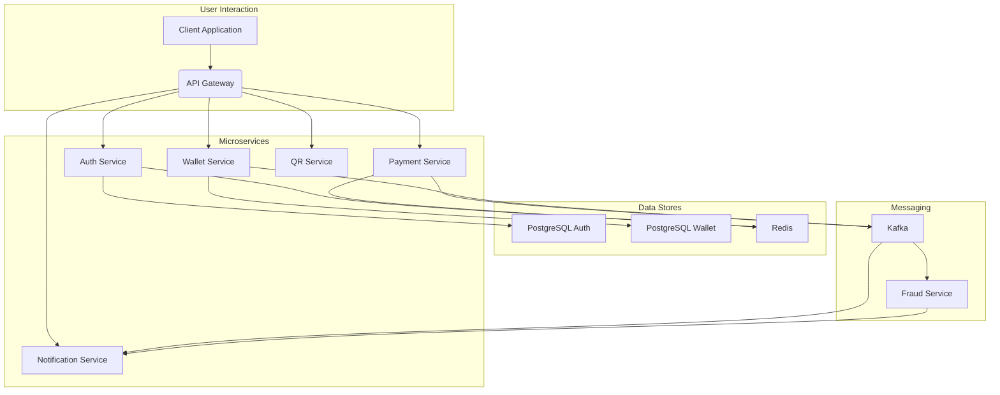

# Fintech Super App Backend

This repository contains the backend services for a PayPay-style Fintech Super App, designed with a microservices architecture.

## Table of Contents
- [Architecture](#architecture)
- [Services](#services)
- [Features](#features)
- [Technical Requirements](#technical-requirements)
- [Setup and Running Locally](#setup-and-running-locally)
  - [Prerequisites](#prerequisites)
  - [Build Services](#build-services)
  - [Run with Docker Compose](#run-with-docker-compose)
- [Deployment to Kubernetes](#deployment-to-kubernetes)
  - [Prerequisites](#kubernetes-prerequisites)
  - [Deploy Services](#deploy-services)
- [API Documentation (Swagger/OpenAPI)](#api-documentation-swaggeropenapi)
- [API Testing (Postman)](#api-testing-postman)
- [Load Testing (k6)](#load-testing-k6)
- [Monitoring (Prometheus + Grafana)](#monitoring-prometheus--grafana)
- [Logging](#logging)

## Architecture

The backend is built using a microservices architecture, orchestrated with Docker and deployable on Kubernetes. Communication between services is primarily event-driven using Apache Kafka.



**Key Components:**
- **API Gateway:** Single entry point for all client requests, routing to appropriate microservices.
- **Microservices:** Independent, loosely coupled services handling specific business domains.
- **Apache Kafka:** Event-driven messaging bus for inter-service communication and data streaming.
- **PostgreSQL:** Primary relational database for persistent data storage.
- **Redis:** In-memory data store for caching and idempotency keys.

## Services

1.  **Auth Service:** Handles user authentication (signup, login, refresh tokens), authorization (JWT, RBAC), and user profile management. Uses PostgreSQL for user data and Redis for refresh tokens.
2.  **Wallet Service:** Manages user digital wallets, balances, top-ups, withdrawals, and transaction history. Uses PostgreSQL for wallet and transaction data. Publishes/consumes events via Kafka.
3.  **Payment Service:** Facilitates Peer-to-Peer (P2P) payments and merchant QR payments. Ensures idempotency using Redis. Publishes payment events to Kafka.
4.  **QR Service:** Generates QR codes with signed payment payloads (HMAC) and verifies scanned QR code data.
5.  **Fraud Service:** Consumes payment events from Kafka, applies rules-based fraud detection, and publishes fraud alerts to Kafka.
6.  **Notification Service:** Provides real-time payment updates and fraud alerts via WebSocket push notifications. Consumes events from Kafka.

## Features

-   **Auth**: Signup, login, refresh token, profile management, roles (user, merchant, admin).
-   **Wallet**: Get balance, transaction history, top-up, withdraw.
-   **Payments**: P2P transfer between users, merchant payment via QR code scan, refund processing (conceptual, handled by Wallet service updates).
-   **QR**: Generate QR with merchant & order data (HMAC signed), scan & verify.
-   **Fraud**: Detect abnormal activity (threshold rules + user spend patterns), send fraud alerts to admin dashboard.
-   **Notifications**: Real-time payment updates, fraud alert push messages.
-   **KYC**: Simulated document upload & approval (conceptual, not implemented in detail in backend services).

## Technical Requirements

-   **Language**: Java Spring Boot
-   **Containerization**: Docker for all services.
-   **Deployment**: Kubernetes manifests for production deployment.
-   **API Documentation**: Swagger/OpenAPI per service.
-   **Security**: HTTPS-ready (handled by API Gateway/Ingress in K8s), Password hashing (bcrypt), HMAC for QR payloads, Idempotency for payments.
-   **Testing**: Unit tests & Integration tests (conceptual, not fully implemented in this example).
-   **Load Testing**: k6 scripts (conceptual, not fully implemented in this example).
-   **Monitoring**: Prometheus + Grafana dashboards (conceptual, not fully implemented in this example).
-   **Logging**: Centralized structured logs (conceptual, not fully implemented in this example).

## Setup and Running Locally

### Prerequisites

-   Java 17 or higher
-   Maven 3.8 or higher
-   Docker Desktop (or Docker Engine and Docker Compose)

### Build Services

Navigate to the root directory of the project (`paypay-fintech`) and build all Spring Boot services:

```bash
./mvnw clean install
```

This will compile the code and package each service into a JAR file, which will then be used by Docker.

### Run with Docker Compose

Once the services are built, you can start all components using Docker Compose:

```bash
docker-compose up --build
```

This command will:
1.  Build Docker images for each microservice.
2.  Start PostgreSQL databases, Redis, Zookeeper, and Kafka containers.
3.  Start all microservice containers.

**Service Endpoints (when running locally via Docker Compose):**
-   **API Gateway:** `http://localhost:8000`
-   **Auth Service:** `http://localhost:8080` (internal to Docker network, accessed via Gateway)
-   **Wallet Service:** `http://localhost:8081` (internal to Docker network, accessed via Gateway)
-   **Payment Service:** `http://localhost:8082` (internal to Docker network, accessed via Gateway)
-   **QR Service:** `http://localhost:8083` (internal to Docker network, accessed via Gateway)
-   **Fraud Service:** `http://localhost:8084` (internal to Docker network)
-   **Notification Service:** `http://localhost:8085` (internal to Docker network, WebSocket endpoint at `/ws`)

## Deployment to Kubernetes

### Kubernetes Prerequisites

-   A running Kubernetes cluster (e.g., Minikube, Kind, GKE, EKS, AKS).
-   `kubectl` configured to connect to your cluster.
-   Docker images of each service pushed to a container registry accessible by your Kubernetes cluster (e.g., Docker Hub, GCR, ECR).

### Deploy Services

First, ensure your Docker images are built and pushed to a registry. Update the `image` fields in the Kubernetes deployment YAMLs to point to your registry's image paths.

Then, apply the Kubernetes manifests. It's recommended to apply infrastructure components first:

```bash
kubectl apply -f k8s/postgres/
kubectl apply -f k8s/redis/
kubectl apply -f k8s/kafka/
```

After the infrastructure is up and running, deploy the microservices and the API Gateway:

```bash
kubectl apply -f k8s/auth-service/
kubectl apply -f k8s/wallet-service/
kubectl apply -f k8s/payment-service/
kubectl apply -f k8s/qr-service/
kubectl apply -f k8s/fraud-service/
kubectl apply -f k8s/notification-service/
kubectl apply -f k8s/api-gateway/
```

To access the API Gateway, find its external IP:

```bash
kubectl get svc api-gateway
```

## API Documentation (Swagger/OpenAPI)

Each Spring Boot microservice is configured with SpringDoc OpenAPI. When running locally via Docker Compose, you can access the Swagger UI for each service through the API Gateway:

-   **Auth Service Swagger UI:** `http://localhost:8000/swagger-ui.html`

## API Testing (Postman)

A Postman collection is provided in the `docs/` directory (`Fintech_Super_App_Backend.postman_collection.json`). Import this file into Postman to test the API endpoints.

## Load Testing (k6)

(Conceptual - k6 scripts would go into the `k6/` directory)

## Monitoring (Prometheus + Grafana)

(Conceptual - Monitoring setup would go into the `monitoring/` directory)

## Logging

(Conceptual - Centralized logging setup would be configured here)
